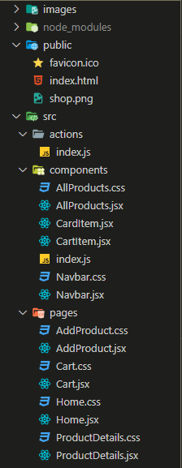

# ShoppingGo App
  - This project is a fantastic E-Commerce app which shows the basic CRUD functionality with the server and database that enables the user to create a product, update, delete the product along with an option to add the product to cart.
  - The user is able to sort the products by price and view the product details as well.
  - This project has an amazing and interactive UI which will make the user to have a great User Experience and it is responsive to all the devices. 
  - The ShoppingGo App is powered by Redux which is an awesome library of react for state management.
  - This project is built using `React.Js`, `CSS`, `Material UI` library, `react-toastify`, `Redux` and `My Json Server` package.

# Features
 - This project provides you the following features: - 
 
## Navbar
  - As you know react is a component driven library, here in this navbar the logo of the website is displayed along with the navigation links and cart page link.
  - The navlinks are built using React-Router-Dom which is lightening fast you know.
  - The cart icon has a badge component of Material UI and it shows the number of cart items present in the shopping cart.

## Home Page or All Products Page
  - This is the component where all the products are listed as cards.
  - Here the component has a `sort by price` tag on clicking on which the user will have the products sorted by their price in ascending order.
  - The product cards show the product image, title, short description, price, rating with count and it provides the user few options link add product to cart, edit product, view details and delete the product from the database (here its a json file).
  - On add to cart, delete and update action the user will be notified with a beautiful toast notification according to the action performed. 
 
## Add Product Page
  - This component holds a form on which the user can fill in and will be able to add a product.
  - On clicking on Add button of the form a toast notification will pop up and it will show  'Product created successfully'.

## Product Detail Page
  - As the name suggests this page or component shows all the detailed information about the product.
  - This component also has a add to cart button to add the product to shopping cart.

## Cart Page
  - This component shows the list of cart items added by the user.
  - Each item in this component has two options increase/decrease the product quantity and remove product from cart.
  
# Screenshots
  - Here are the screenshots of the App.
  ## Project Directory Structure
  

# Getting Started with Create React App

This project was bootstrapped with [Create React App](https://github.com/facebook/create-react-app).

## Available Scripts

In the project directory, you can run:

### `npm start`

Runs the app in the development mode.\
Open [http://localhost:3000](http://localhost:3000) to view it in your browser.

The page will reload when you make changes.\
You may also see any lint errors in the console.

### `npm test`

Launches the test runner in the interactive watch mode.\
See the section about [running tests](https://facebook.github.io/create-react-app/docs/running-tests) for more information.

### `npm run build`

Builds the app for production to the `build` folder.\
It correctly bundles React in production mode and optimizes the build for the best performance.

The build is minified and the filenames include the hashes.\
Your app is ready to be deployed!

See the section about [deployment](https://facebook.github.io/create-react-app/docs/deployment) for more information.

### `npm run eject`

**Note: this is a one-way operation. Once you `eject`, you can't go back!**

If you aren't satisfied with the build tool and configuration choices, you can `eject` at any time. This command will remove the single build dependency from your project.

Instead, it will copy all the configuration files and the transitive dependencies (webpack, Babel, ESLint, etc) right into your project so you have full control over them. All of the commands except `eject` will still work, but they will point to the copied scripts so you can tweak them. At this point you're on your own.

You don't have to ever use `eject`. The curated feature set is suitable for small and middle deployments, and you shouldn't feel obligated to use this feature. However we understand that this tool wouldn't be useful if you couldn't customize it when you are ready for it.

## Learn More

You can learn more in the [Create React App documentation](https://facebook.github.io/create-react-app/docs/getting-started).

To learn React, check out the [React documentation](https://reactjs.org/).

### Code Splitting

This section has moved here: [https://facebook.github.io/create-react-app/docs/code-splitting](https://facebook.github.io/create-react-app/docs/code-splitting)

### Analyzing the Bundle Size

This section has moved here: [https://facebook.github.io/create-react-app/docs/analyzing-the-bundle-size](https://facebook.github.io/create-react-app/docs/analyzing-the-bundle-size)

### Making a Progressive Web App

This section has moved here: [https://facebook.github.io/create-react-app/docs/making-a-progressive-web-app](https://facebook.github.io/create-react-app/docs/making-a-progressive-web-app)

### Advanced Configuration

This section has moved here: [https://facebook.github.io/create-react-app/docs/advanced-configuration](https://facebook.github.io/create-react-app/docs/advanced-configuration)

### Deployment

This section has moved here: [https://facebook.github.io/create-react-app/docs/deployment](https://facebook.github.io/create-react-app/docs/deployment)

### `npm run build` fails to minify

This section has moved here: [https://facebook.github.io/create-react-app/docs/troubleshooting#npm-run-build-fails-to-minify](https://facebook.github.io/create-react-app/docs/troubleshooting#npm-run-build-fails-to-minify)
