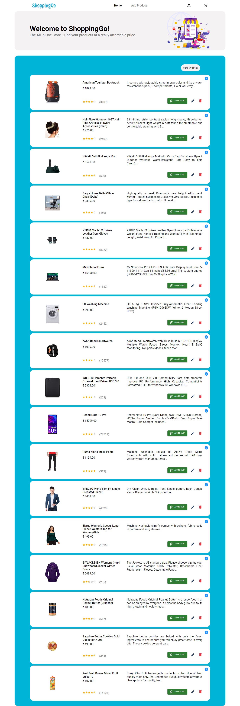

# ShoppingGo App
  - This project is a fantastic E-Commerce app which shows the basic CRUD functionality with the server and database that enables the user to create a product, update, delete the product along with an option to add the product to cart.
  - The user is able to sort the products by price and view the product details as well.
  - This project has an amazing and interactive UI which will make the user to have a great User Experience and it is responsive to all the devices. 
  - The ShoppingGo App is powered by Redux which is an awesome library of react for state management.
  - This project is built using `React.Js`, `CSS`, `Material UI` library, `react-toastify`, `Redux` and `My Json Server` package.

# Features
 - This project provides you the following features: - 
 
## Navbar
  - As you know react is a component driven library, here in this navbar the logo of the website is displayed along with the navigation links and cart page link.
  - The navlinks are built using React-Router-Dom which is lightening fast you know.
  - The cart icon has a badge component of Material UI and it shows the number of cart items present in the shopping cart.

## Home Page or All Products Page
  - This is the component where all the products are listed as cards.
  - Here the component has a `sort by price` tag on clicking on which the user will have the products sorted by their price in ascending order.
  - The product cards show the product image, title, short description, price, rating with count and it provides the user few options link add product to cart, edit product, view details and delete the product from the database (here its a json file).
  - On add to cart, delete and update action the user will be notified with a beautiful toast notification according to the action performed. 
 
## Add Product Page
  - This component holds a form on which the user can fill in and will be able to add a product.
  - On clicking on Add button of the form a toast notification will pop up and it will show  'Product created successfully'.

## Product Detail Page
  - As the name suggests this page or component shows all the detailed information about the product.
  - This component also has a add to cart button to add the product to shopping cart.

## Cart Page
  - This component shows the list of cart items added by the user.
  - Each item in this component has two options increase/decrease the product quantity and remove product from cart.
  
# Screenshots
  - Here are the screenshots of the App.
  ## Project Directory Structure
  
  
  
  ## Home Page
  
  
  ## Add Product Page
  
  
  ## Product Details Page
  
  
  ## Cart Page
  
  
# Steps to run the project on your local machine
  - Before starting the server you have to Open terminal and run `npm install` to install all the dependencies to run the project.
  - Then run the command `node server.js` to start the server which will serve the `db.json` file.
  - Now run the react frontend with the command `npm start`.
